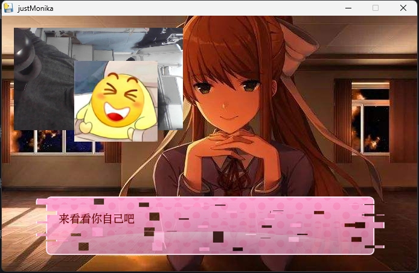

# Forever With You (永远与你同在)

一个充满浪漫和创意的视觉小说游戏(实际就三十分钟流程捏),灵感来源于Doki Doki Literature Club (DDLC).这个项目通过实时摄像头监测和互动对话,创造出一个独特的陪伴体验.

实际上是三年前2022年12月疫情即将解封的时候给喜欢的女孩的gameplay的一个小项目.虽然最后还是意难平了捏,无所谓了捏,今天我偶然看到了这个项目我决定上传github上,希望能给大家带来一些启发.以及外来我应该还会继续去修复,直到我有爱的人.
## 项目特点

- 实时摄像头监测:通过OpenCV实现实时人脸检测,让角色能够感知你的存在
- 动态对话系统:根据不同场景和互动展现不同的对话内容
- 精美的视觉效果:使用Pygame引擎实现的精美UI界面
- 沉浸式音频:融入背景音乐,提升游戏体验

## 技术栈

- Python 3.10
- Pygame:游戏引擎
- OpenCV:实时摄像头处理
- Numpy:数据处理

## 安装说明

1. 克隆项目到本地
2. 安装依赖:
```bash
pip install -r requirements.txt
```

## 运行方式

直接运行主程序:
```bash
python mainn.py
```

## 使用说明

1. 启动程序后,请确保摄像头正常工作
2. 通过键盘和鼠标与游戏进行互动
3. 享受专属于你的陪伴时光

## 技术亮点

- 实时人脸检测:使用OpenCV实现实时监测玩家状态
- 动态场景切换:根据不同时间和互动实现场景转换
- 自适应对话系统:根据玩家行为调整对话内容

## 注意事项

- 首次运行时请确保摄像头权限已开启
- 建议在安静的环境中体验,以获得最佳效果

## 关于作者

这是一个充满爱与创意的项目,希望能为每个使用者带来温暖和陪伴.

---

愿这个项目能让你感受到专属于你的浪漫时光.

123
以及偷拍屏幕前的你捏
  